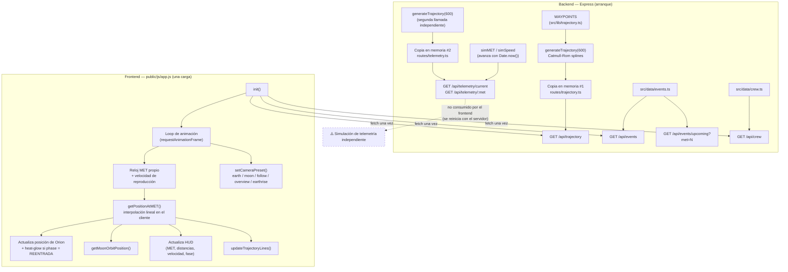

# Artemis II Skills Lab

Simulador 3D interactivo de la misión Artemis II de la NASA — el primer vuelo tripulado a distancia lunar desde el Apollo 17. Orion, con cuatro astronautas a bordo, recorre una trayectoria de retorno libre alrededor de la Luna a lo largo de 9 días.

> **Nota:** este repositorio se usa además como banco de pruebas de **Claude Code skills** (`.claude/skills/`). No es solo la app — es donde se valida que los skills del proyecto (agregar eventos, generar vistas de cámara, aplicar convenciones de escena 3D, etc.) funcionan como se espera antes de darlos por buenos.

## Requisitos

- Node.js 20+

## Comandos

```bash
npm install
npm run dev      # tsx watch src/server.ts — servidor de desarrollo con hot reload en http://localhost:3000
npm test         # vitest run — toda la suite de tests
npm run build    # tsc — compila src/ a dist/
npm start        # node dist/server.js — ejecuta el build compilado
```

Ejecutar un test puntual:

```bash
npx vitest run tests/orbital-math.test.ts
npx vitest run -t "nombre del test"
```

## Arquitectura

Backend en Express (TypeScript/ESM) que expone una API JSON y sirve el frontend estático (`public/`) — un único módulo ES (`public/js/app.js`) que importa Three.js y Chart.js desde CDN vía `importmap`, sin bundler.

La trayectoria se genera una vez al arrancar el servidor (splines Catmull-Rom sobre 23 waypoints, `src/lib/trajectory.ts`). El frontend hace fetch de `/api/trajectory`, `/api/events` y `/api/crew` **una sola vez** al cargar y desde ahí simula todo del lado del cliente: su propio reloj de MET, control de velocidad de reproducción, e interpolación de posición.

Ver [`CLAUDE.md`](./CLAUDE.md) para el detalle completo de la arquitectura, el sistema de coordenadas 3D, las convenciones de color y los datos de la misión.

### Diagrama de flujo



## API

| Endpoint | Descripción |
|----------|--------------|
| `GET /api/trajectory` | Los 600 puntos de la trayectoria con telemetría |
| `GET /api/events` | Los 25 eventos de la misión |
| `GET /api/events/upcoming?met=N` | Próximos 3 eventos desde un MET dado |
| `GET /api/telemetry/current` | Telemetría simulada del lado del servidor (no usada por el frontend) |
| `GET /api/telemetry/:met` | Telemetría en un MET concreto (segundos) |
| `GET /api/crew` | Información de la tripulación |

## Skills de este repo (`.claude/skills/`)

| Skill | Qué hace |
|-------|----------|
| `add-event` | Agrega un evento nuevo a la línea de tiempo (`src/data/events.ts`), calculando su fase de misión |
| `capture-view` | Genera un bookmark de cámara para un MET y preset específicos |
| `scene-conventions` | Convenciones de color/escala/rendimiento para tocar la escena 3D (`public/js/**`, `src/**`) |

`add-event` y `capture-view` están marcados `disable-model-invocation: true`: solo se ejecutan tecleando `/add-event` o `/capture-view` directamente, no de forma automática.

## Tripulación

| Nombre | Rol | Agencia |
|--------|-----|---------|
| Reid Wiseman | Comandante | NASA |
| Victor Glover | Piloto | NASA |
| Christina Koch | Especialista de Misión 1 | NASA |
| Jeremy Hansen | Especialista de Misión 2 | CSA |
